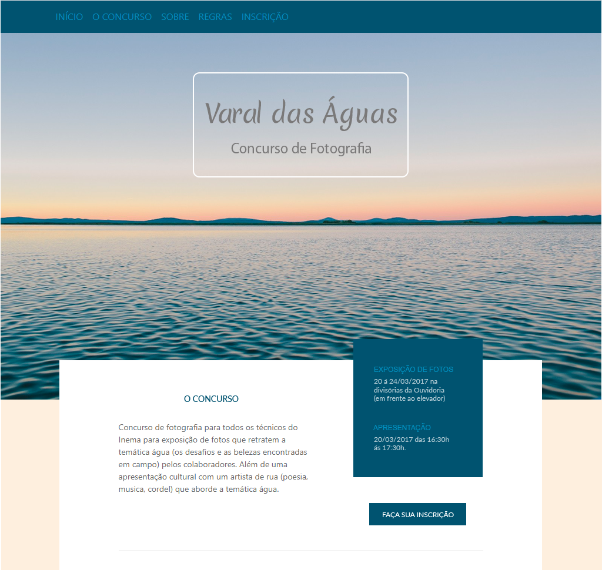
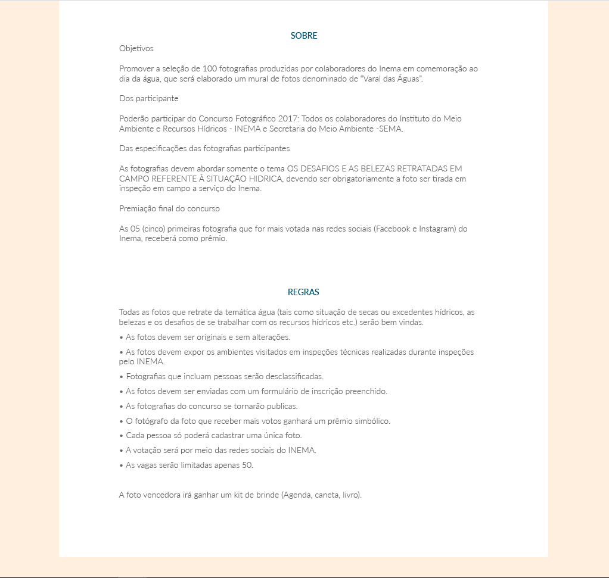
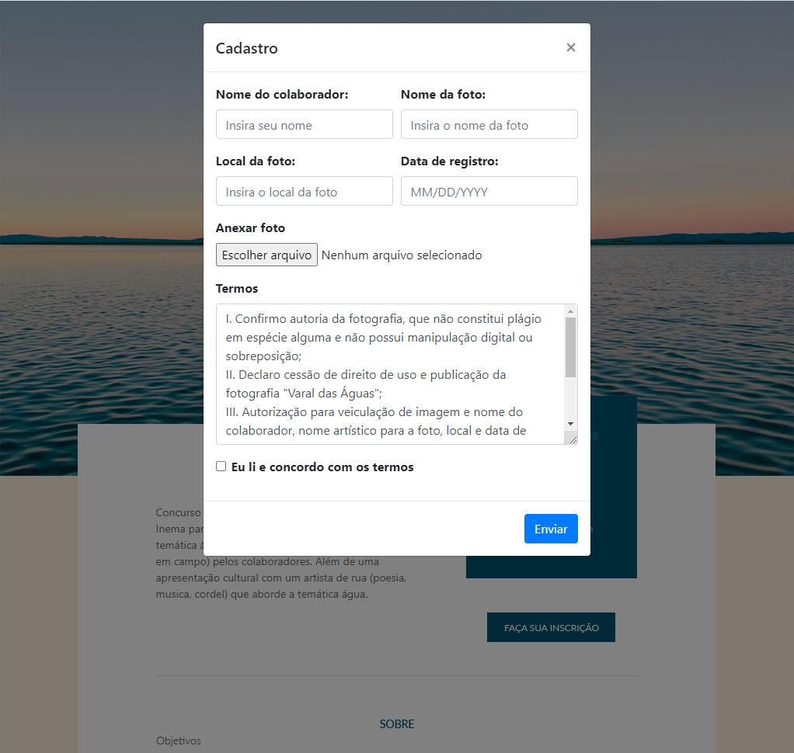

<h1 align="center">Varal das Águas</h1>

Aplicação desafio com objetivo de avaliar conhecimento sobre o desenvolvimento de aplicações Web com ênfase no aspecto Front-end.

A aplicação consiste em uma Single Page Application (SPA) que será responsável por um cadastro de fotos para um concurso que tem por tema: "Águas".

<!-- <p align="center">
	<a href="https://github.com/tarcisioaraujo/blog-laravel-vue/issues">
		
	</a>	
		 
</p> -->

<p align="center">
	<a href="#computer-tecnologias">Tecnologias</a> •		
	<a href="#runner-começando">Começando</a> •
	<a href="#warning-pré-requisitos">Pré-requisitos</a> •	
	<a href="#hammer_and_wrench-instalação">Instalação</a> •	
	<a href="#construction_worker-autor">Autor</a> •
	<a href="#memo-licença">Licença</a>
</p>

<p align="center">
	<kbd>
		
	</kbd>	
	<kbd>
		
	</kbd>
    <kbd>
		
	</kbd>	
</p>

## :computer: Tecnologias 

- [Vue](https://vuejs.org/)
- [Bootstrap 4](https://getbootstrap/)

## :runner: Começando 

Essas instruções fornecerão uma cópia do projeto instalado e funcionando em sua máquina local.

## :warning: Pré-requisitos 

O que você precisar para instalar a aplicação

```
Node >= 6.x
Npm >= 3.x
```

## :hammer_and_wrench: Instalação

Passos para rodar a aplicação

```
# Clonar
git clone https://github.com/tarcisioaraujo/spa-varal-das-aguas.git

# Acessar o diretório
cd spa-varal-das-aguas

# Instalar e atualizar as dependências do projeto (pode levar alguns minutos ☕)
npm i

# Rodar versão de desenvolvimento
npm run dev

# Acessar o endereço 
http://localhost:8080/

# Construir versão de produção 
# (Obs.: Será criada no diretório /dist e para acessá-la é necessário rodar algum servidor http)
npm run build
```

## :construction_worker: Autor

<a href="https://github.com/tarcisioaraujo">
 
 <br />
 <sub><b>Tarcísio Silva de Araújo</b></sub></a> <a href="https://github.com/tarcisioaraujo" title="GitHub"></a>

Feito por Tarcísio Silva de Araújo :wave:

[](https://www.linkedin.com/in/tarcisiosaraujo/) 
[](mailto:tarcisio.saraujo@gmail.com)

## :memo: Licença

Este projeto esta sobe a licença [MIT](./LICENSE).
